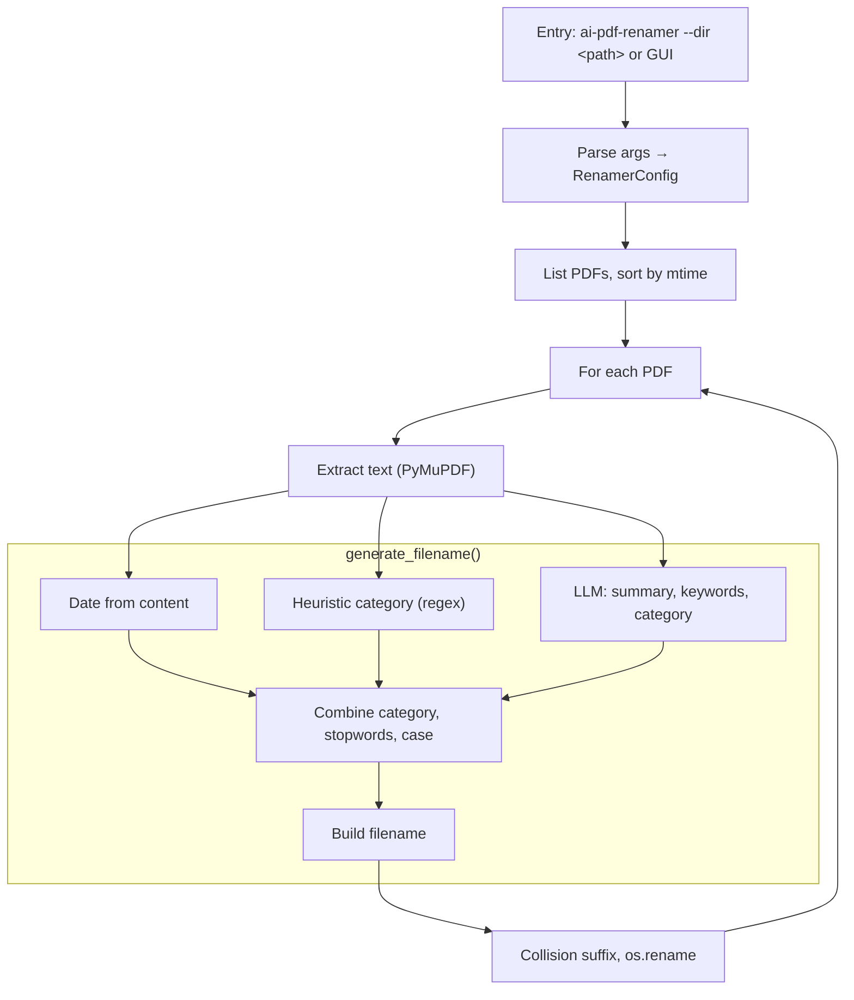

# AI-PDF-Renamer

Rename PDFs based on extracted text, heuristic scoring, and an optional local LLM. The tool inspects PDF content, proposes a category/keywords/summary, and builds a deterministic filename such as:

```text
YYYYMMDD-category-keywords-summary.pdf
```

## Table of Contents

0. [Documentation](#documentation)
1. [Overview](#overview)
2. [Features](#features)
3. [Requirements](#requirements)
4. [Quickstart](#quickstart)
5. [Configuration](#configuration)
6. [Usage](#usage)
7. [How It Works](#how-it-works)
8. [Repository flow](#repository-flow)
9. [Development](#development)
10. [Testing](#testing)
11. [Validation (build / run / test)](#validation-build--run--test)
12. [Security](#security)
13. [Troubleshooting](#troubleshooting)
14. [Known issues and fixes](#known-issues-and-fixes)
15. [Potential Improvements](#potential-improvements)

## Documentation

All project documentation is in **English**. Full index:

- **[docs/README.md](docs/README.md)** – Documentation index (architecture, runbook, design, bugs).
- **Agent map:** [AGENTS.md](AGENTS.md).
- **Key technical docs:** [docs/ARCHITECTURE.md](docs/ARCHITECTURE.md) (workflow, components), [docs/RUNBOOK.md](docs/RUNBOOK.md) (setup, env, options), [docs/RECOGNITION-RATE.md](docs/RECOGNITION-RATE.md), [BUGS_AND_FIXES.md](BUGS_AND_FIXES.md). **Library usage:** [docs/API.md](docs/API.md) (stable API, `generate_filename` without renaming).

## Overview

Many PDF documents are poorly named (e.g., `Scan0001.pdf`). This tool:

1. Extracts text from PDFs using PyMuPDF.
2. Scores regex-based heuristic categories from `heuristic_scores.json`.
3. Optionally queries a local LLM for summary, keywords, and a suggested category.
4. Combines heuristic + LLM categories (heuristics win when present).
5. Filters prompt artifacts via `meta_stopwords.json`.
6. Renames PDFs to include date, category, keywords, and short summary tokens.

If a document is larger than the 128K-context single-shot limit (~480k characters), the text is chunked and summarized in parts before a final summary is produced.

## Features

- Heuristic scoring with weighted regex rules.
- Local LLM support via HTTP POST for summaries, keywords, and categories.
- Chunking for large PDFs.
- Flexible naming (kebab/camel/snake case).
- Meta stopword filtering.
- Collision-safe renaming (suffixes `_1`, `_2`, ...).

## Requirements

- Python 3.13+
- `requests`
- `pymupdf` (for PDF extraction)
- Optional: `tiktoken` (better token counting)
- Optional local LLM endpoint listening on `http://127.0.0.1:11434/v1/completions`

## Quickstart

```bash
python -m venv .venv
source .venv/bin/activate
python -m pip install -U pip
python -m pip install -e '.[dev,pdf]'
```

Optional token counting support:

```bash
python -m pip install -e '.[tokens]'
```

## Configuration

### Data files

The renamer expects these JSON files:

- `heuristic_scores.json` (regex rules + scores)
- `meta_stopwords.json` (tokens to remove from filenames)
- `heuristic_patterns.json` (legacy; currently unused by code)

By default, the package ships with these files. You can override the location via:

- `AI_PDF_RENAMER_DATA_DIR` (directory containing the JSON files)

### Local LLM endpoint

By default the client uses:

- `http://127.0.0.1:11434/v1/completions`
- Default model: **qwen3:8b** (optimized for 128K context)

If your endpoint differs, update `LocalLLMClient` in `src/ai_pdf_renamer/llm.py`.

**Proxy:** The built-in client disables proxy use (`trust_env=False`) so prompt content stays on-device. If you use a custom client or wrapper, set `NO_PROXY=127.0.0.1,localhost` so the LLM traffic is not forwarded. See [SECURITY.md](SECURITY.md).

**128K context (Qwen3 8B):** The pipeline is tuned for Qwen3 8B with a 128K token context: PDF text is passed in one shot up to ~120K tokens; only very long documents are chunked. For Ollama, set the context size when running the server (e.g. `OLLAMA_NUM_CTX=131072`) or in the model’s Modelfile so the server accepts long prompts. See [docs/RUNBOOK.md](docs/RUNBOOK.md#ollama-128k-context-qwen3-8b).

## Usage

Run interactively:

```bash
python ren.py
```

Or via installed CLI:

```bash
ai-pdf-renamer --dir ./input_files
```

Desktop GUI (folder picker, options, dry-run preview, apply):

```bash
ai-pdf-renamer-gui
```

Interactive inputs:

- Directory path (default: `./input_files`)
- Language (`de` or `en`)
- Desired case (`kebabCase`, `camelCase`, `snakeCase`)
- Project (optional)
- Version (optional)

If the target directory does not exist, the CLI exits with a clear error.

**Undo renames:** If you used `--rename-log FILE`, revert renames with:

```bash
ai-pdf-renamer-undo --rename-log FILE [--dry-run]
# or: python scripts/undo_renames.py -l FILE [--dry-run]
```

See [docs/RUNBOOK.md](docs/RUNBOOK.md) for more options (recursive, single file, plan file, watch, export metadata).

## How It Works

1. **Extract PDF text**
   - Uses PyMuPDF to collect text from multiple extraction modes.
2. **Optional chunking**
   - Large text is split into overlapping chunks; partial summaries are merged.
3. **Heuristic category**
   - Regex patterns are scored; the highest score wins.
4. **LLM summaries & keywords**
   - Prompts request JSON-only responses; retries increase temperature.
5. **Filename generation**
   - Final filename includes: date, optional project/version, category, keywords, summary tokens.

## Repository flow

From invocation to the renamed PDF:



See [docs/ARCHITECTURE.md](docs/ARCHITECTURE.md) for the full workflow and component map.

ASCII overview:

```text
┌─────────────────────────────────────────────────────────────────────────────┐
│  Entry: python ren.py  or  ai-pdf-renamer --dir <path>                       │
└─────────────────────────────────────────────────────────────────────────────┘
                                        │
                                        ▼
┌─────────────────────────────────────────────────────────────────────────────┐
│  CLI (cli.py)                                                               │
│  • Prompt/--dir for directory, language (de/en), case (kebab/camel/snake),   │
│    optional project & version                                               │
│  • Build RenamerConfig → rename_pdfs_in_directory(dir, config)               │
└─────────────────────────────────────────────────────────────────────────────┘
                                        │
                                        ▼
┌─────────────────────────────────────────────────────────────────────────────┐
│  Directory (renamer.py)                                                      │
│  • .pdf files only, sorted by mtime (newest first)                          │
│  • For each PDF:                                                             │
└─────────────────────────────────────────────────────────────────────────────┘
                                        │
        ┌───────────────────────────────┼───────────────────────────────┐
        ▼                               ▼                               ▼
┌───────────────┐             ┌─────────────────┐             ┌─────────────────┐
│ pdf_extract   │             │ renamer         │             │ Output          │
│ pdf_to_text() │────────────▶│ generate_       │────────────▶│ Collision check │
│ (PyMuPDF)     │  raw text   │ filename()      │  new name   │ _1, _2…         │
└───────────────┘             └────────┬────────┘             │ os.rename()     │
                                        │                      └─────────────────┘
                    ┌───────────────────┼───────────────────┐
                    ▼                   ▼                   ▼
            ┌───────────────┐   ┌───────────────┐   ┌───────────────┐
            │ text_utils     │   │ heuristics     │   │ llm.py        │
            │ Date from      │   │ Regex score    │   │ Summary,      │
            │ content        │   │ → category     │   │ Keywords,     │
            └───────────────┘   └───────────────┘   │ Category,     │
                    │                   │             │ final tokens  │
                    │                   │             └───────┬───────┘
                    │                   │                     │
                    │                   │             (long text:
                    │                   │              chunking in llm.py)
                    ▼                   ▼                     ▼
            ┌─────────────────────────────────────────────────────────────┐
            │  Filename build (renamer):                                   │
            │  YYYYMMDD [- project] - category [- keywords] [- summary]      │
            │  [- version].pdf   + stopwords filter (meta_stopwords.json)  │
            │  + subtract_tokens (no duplicates across category→keywords→   │
            │    summary)                                                    │
            └─────────────────────────────────────────────────────────────┘
```

**Per-PDF summary:**

| Step | Module / data | Action |
|------|----------------|--------|
| 1 | `cli.py` | Directory, language, case, optional project/version |
| 2 | `renamer.py` | PDF list (`.pdf` only), sorted by mtime |
| 3 | `pdf_extract.py` | Extract text with PyMuPDF |
| 4 | `llm.py` | Summary (chunked if long), then keywords, category, final tokens (JSON, local endpoint) |
| 5 | `heuristics.py` | Regex category from `heuristic_scores.json`; combined with LLM category (heuristic wins when present) |
| 6 | `text_utils.py` | Date from content, filter stopwords, clean tokens, apply case (kebab/camel/snake) |
| 7 | `renamer.py` | Build filename; on collision use `_1`, `_2` …; `os.rename` (or copy+unlink across filesystems) |

## Development

```bash
ruff format .
ruff check .
pytest -q
```

## Testing

```bash
pytest -q
```

## Validation (build / run / test)

From the project root:

```bash
# Install with dev and PDF extras
python -m venv .venv
source .venv/bin/activate   # Windows: .venv\Scripts\activate
python -m pip install -U pip
python -m pip install -e '.[dev,pdf]'

# Lint and test (same as CI)
ruff format --check .
ruff check .
pytest -q

# Optional: build wheel/sdist
python -m pip install -U build
python -m build

# Run the tool (interactive or with args)
python ren.py
# or: ai-pdf-renamer --dir ./input_files --language en --case kebabCase
```

## Security

- This tool can send document text to an LLM endpoint. Use a local endpoint if you need data to stay on-device.
- CI includes security checks:
  - CodeQL (SAST)
  - Dependency Review (PR-only)
  - `pip-audit` (SCA)
  - TruffleHog (secret scanning)

See `docs/RUNBOOK.md` for runbook commands and `SECURITY.md` for reporting guidance.

## Troubleshooting

- **`RuntimeError: PyMuPDF is required for PDF extraction`**
  - Install PDF dependencies: `python -m pip install -e '.[pdf]'`
- **Empty or low-quality LLM output**
  - Verify your local LLM endpoint is running and returns JSON with the expected key.
- **Data files not found**
  - Ensure the JSON files exist in the package or set `AI_PDF_RENAMER_DATA_DIR`.

## Known issues and fixes

For a detailed list of known bugs, required fixes, and improvements, see **[BUGS_AND_FIXES.md](BUGS_AND_FIXES.md)**.

Summary:

1. **LLM variability**
   - Some local LLMs return non-JSON or partial answers. The code retries with fallback prompts but may still return `na`.
2. **False positives in regex**
   - PDFs might match category patterns unintentionally; tune `heuristic_scores.json` as needed.
3. **Very large PDFs**
   - Chunking helps, but large scanned PDFs may still yield partial summaries.
4. **Date extraction**
   - Date parsing is heuristic and can pick misleading date strings.

## Potential Improvements

1. Better chunking/context handling for long documents.
2. Multi-language heuristic rule sets (per-locale JSON files).
3. Parallel processing for large directories.
4. Optional metadata export (CSV/JSON) before renaming.
5. **Scanned PDFs:** Use `--ocr` so the tool runs OCR when PDFs have little text; install with `.[ocr]` and Tesseract. See [docs/RUNBOOK.md](docs/RUNBOOK.md).
6. **GUI:** Run `ai-pdf-renamer-gui` for a desktop wrapper (folder picker, progress, dry-run preview, apply). See [docs/RUNBOOK.md](docs/RUNBOOK.md#gui).
7. See [docs/RUNBOOK.md](docs/RUNBOOK.md) and [BUGS_AND_FIXES.md](BUGS_AND_FIXES.md) for more options and improvement notes.
