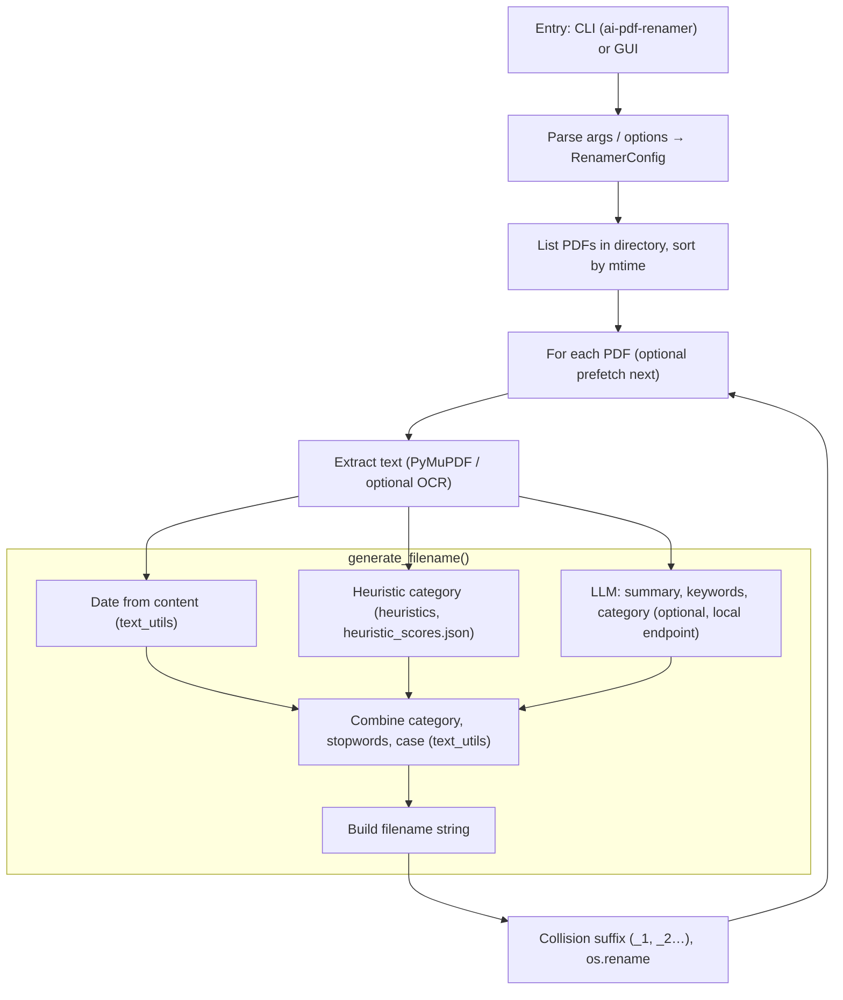

# Architecture – AI-PDF-Renamer

Top-level map of domains, components, and data flow. For detailed design decisions see [DESIGN.md](DESIGN.md).

## 1. Domain and scope

Single domain: **batch PDF renaming by content**. No separate services; one CLI process operates on one directory per run.

## 2. Workflow (Mermaid)



- **Entry:** CLI (`ai-pdf-renamer --dir <path>`) or GUI (folder picker, options, dry-run/apply).
- **Per PDF:** Extract text → generate filename (date + heuristic + optional LLM → combine → build) → rename with collision handling.
- **Data:** `heuristic_scores.json`, `meta_stopwords.json` (and optional `category_aliases.json`) from package data or `AI_PDF_RENAMER_DATA_DIR`.

## 3. Component map

```text
┌─────────────────────────────────────────────────────────────────────────────┐
│  Entry: python ren.py  |  ai-pdf-renamer --dir <path>                        │
└─────────────────────────────────────────────────────────────────────────────┘
                                        │
                                        ▼
┌─────────────────────────────────────────────────────────────────────────────┐
│  CLI (cli.py)                                                                │
│  Args: --dir, --language, --case, --project, --version, --prefer-llm,        │
│        --date-format. Interactive prompts when flags omitted and TTY.        │
│  Output: RenamerConfig → rename_pdfs_in_directory(dir, config)               │
└─────────────────────────────────────────────────────────────────────────────┘
                                        │
                                        ▼
┌─────────────────────────────────────────────────────────────────────────────┐
│  Directory (renamer.py)                                                      │
│  .pdf only, sorted by mtime (newest first). Per file: extract → name → rename│
└─────────────────────────────────────────────────────────────────────────────┘
        │
        ├── pdf_extract.py    PDF → raw text (PyMuPDF)
        ├── renamer.py        generate_filename(), collision handling, os.rename
        ├── llm.py            Summary, keywords, category, final tokens (HTTP)
        ├── heuristics.py     Regex scoring → category (heuristic_scores.json)
        ├── text_utils.py     Date, stopwords, clean_token, case, subtract_tokens
        └── data_paths.py     Resolve heuristic_scores.json, meta_stopwords.json
```

## 4. Layer dependencies (logical)

- **CLI** depends on **Renamer** and **Config**.
- **Renamer** depends on: **pdf_extract**, **llm**, **heuristics**, **text_utils**, **data_paths**.
- **Data:** JSON config under package data or `AI_PDF_RENAMER_DATA_DIR`; no DB.

Strict layering is not enforced by linters (small codebase); this document is the architectural contract. New code should not introduce circular imports or bypass these boundaries.

## 5. Data flow (per PDF)

| Step | Component / data | Responsibility |
|------|------------------|----------------|
| 1 | cli.py | Directory, language, case, project, version, prefer_llm, date_format |
| 2 | renamer.py | List PDFs, sort by mtime |
| 3 | pdf_extract.py | Extract text (PyMuPDF); single strategy per page (text → blocks → rawdict fallback) |
| 4 | llm.py | Summary (chunked if long; doc-type hint when heuristic suggests type), keywords (optional suggested_category), category, final_summary_tokens (JSON) |
| 5 | heuristics.py | Regex category from heuristic_scores.json (optionally on leading chars for long docs); combine with LLM (heuristic wins unless prefer_llm) |
| 6 | text_utils.py | Date from content (optional prefer_leading_chars; Stand:/Datum:/month-year formats), stopwords filter, clean_token, case, subtract_tokens |
| 7 | renamer.py | Build filename; sanitize; collision suffix _1,_2…; os.rename or copy+unlink on EXDEV |

## 6. External boundaries

- **File system:** Read PDFs from one directory; write renames in place (same dir). No network filesystem assumptions beyond normal path handling.
- **Network:** Optional HTTP POST to local LLM (`http://127.0.0.1:11434/v1/completions` by default). No other outbound calls. Proxy must be disabled for this client to keep data on-device (see SECURITY.md / BUGS_AND_FIXES).
- **Config:** Environment variable `AI_PDF_RENAMER_DATA_DIR`; CLI args. No secrets in repo.

## 7. Key files

| File | Role |
|------|------|
| `src/ai_pdf_renamer/cli.py` | Argument parsing, prompts, RenamerConfig, call renamer |
| `src/ai_pdf_renamer/renamer.py` | Directory iteration, generate_filename, collision, rename |
| `src/ai_pdf_renamer/pdf_extract.py` | pdf_to_text (PyMuPDF) |
| `src/ai_pdf_renamer/llm.py` | LocalLLMClient, JSON parsing, chunking for long text |
| `src/ai_pdf_renamer/heuristics.py` | HeuristicScorer, load_heuristic_rules, combine_categories |
| `src/ai_pdf_renamer/text_utils.py` | Dates, stopwords, clean_token, convert_case, subtract_tokens |
| `src/ai_pdf_renamer/data_paths.py` | data_path(filename) for allowed JSON data files |

## 8. References

- [README](../README.md) – Repository flow diagram and usage.
- [DESIGN.md](DESIGN.md) – Design overview and key decisions.
- [RECOGNITION-RATE.md](RECOGNITION-RATE.md) – Who leads (heuristic vs LLM), when heuristic applies, Qwen-128K usage, recognition-rate improvements.
- [BUGS_AND_FIXES.md](../BUGS_AND_FIXES.md) – Known issues and required fixes.
